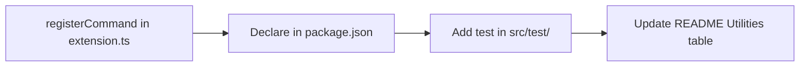

# AGENTS.md

Instructions for AI agents working in the **dev-toolbox** repository.

## Project Overview

**dev-toolbox** is a VS Code extension that bundles small developer utilities under a single `Dev Toolbox:` command prefix. Instead of installing many single-purpose extensions, contributors add utilities here so everyone can share them.

### Stack

- TypeScript
- pnpm
- esbuild
- ESLint (flat config)
- Prettier
- Mocha + `@vscode/test-electron`

### Key Paths

| Path                         | Purpose                                     |
| ---------------------------- | ------------------------------------------- |
| `src/extension.ts`           | Command registration in `activate()`        |
| `package.json`               | Extension manifest (`contributes.commands`) |
| `src/test/extension.test.ts` | Extension tests                             |
| `dist/`                      | Build output — do not edit manually         |

### Requirements

- VS Code `^1.125.0`
- Node.js 24+

### Utility Lifecycle



## Code Quality (ESLint & Prettier)

Always comply with the project's linting and formatting rules. Do not submit code that fails ESLint or Prettier checks.

### ESLint

Configured in [`eslint.config.mjs`](eslint.config.mjs):

- TypeScript recommended + stylistic rules
- `eslint-config-prettier` prevents conflicts with Prettier

### Prettier

Configured in [`.prettierrc.json`](.prettierrc.json):

- 120 print width
- 2-space indent, no tabs
- Double quotes
- Trailing commas
- LF line endings

### Before Finishing a Task

Run these checks and fix any issues:

```bash
pnpm run lint
pnpm run format:check
pnpm run check-types
```

If `format:check` fails, run `pnpm run format` to auto-fix, then re-check.

The workspace is set up for format-on-save and ESLint auto-fix in [`.vscode/settings.json`](.vscode/settings.json). Match that behavior in your edits.

When a task is complete, **lint and format must pass before committing**. Fix any failures first; do not commit until both succeed.

## Code Style Principles

1. **Minimize scope** — Use the smallest correct diff. Do not add or change unrelated code.
2. **Match existing conventions** — Follow patterns in [`src/extension.ts`](src/extension.ts). For example, push every command disposable onto `context.subscriptions`.
3. **Command IDs** — Use the `dev-toolbox.*` namespace. Command Palette titles must use the `Dev Toolbox: ` prefix.
4. **Self-explanatory code** — Add comments only for non-obvious business logic or deep technical details.
5. **Tests** — Add or update tests in `src/test/` when adding or changing utilities.

## Adding a New Utility

Follow this checklist for every new utility:

1. **Register the command** in `src/extension.ts` inside `activate()`:

   ```ts
   const disposable = vscode.commands.registerCommand("dev-toolbox.yourUtility", () => {
     // your utility here
   });

   context.subscriptions.push(disposable);
   ```

2. **Declare it in the manifest** — add a matching entry to `contributes.commands` in `package.json`. The `command` ID must exactly match what you registered, and the `title` must use the `Dev Toolbox: ` prefix:

   ```json
   {
     "command": "dev-toolbox.yourUtility",
     "title": "Dev Toolbox: Your Utility"
   }
   ```

3. **Add a test** in [`src/test/extension.test.ts`](src/test/extension.test.ts).

4. **Document it** — add a row to the Utilities table in [`README.md`](README.md).

## Git Workflow & Commits

### When to Commit

**Always commit automatically** after completing each discrete task — even when the user does not explicitly ask you to commit.

The only exception: the user explicitly asks you **not** to commit.

### Task Completion Flow

1. Finish the task changes.
2. Run `pnpm run lint` and `pnpm run format:check` (and `pnpm run check-types` when TypeScript changed).
3. Fix any lint or format failures and re-run until both pass.
4. Create one git commit for that task.
5. Do not push unless the user explicitly asks.

Do not skip the commit step when lint and format succeed. Do not commit when lint or format still fails.

### Commit Granularity

One logical task = one commit. Do not batch unrelated changes into a single commit.

### Message Format

```
<gitmoji> <imperative English description>
```

Do **not** use conventional-commit type prefixes (`feat:`, `fix:`, etc.).

**Examples:**

- `✨ add json formatter utility`
- `🐛 fix command registration cleanup`
- `♻️ refactor extension activation setup`
- `📝 update README utilities table`
- `✅ add test for hello world command`

### Gitmoji Reference

| Emoji | Use when                            |
| ----- | ----------------------------------- |
| ✨    | New feature / utility               |
| 🐛    | Bug fix                             |
| ♻️    | Refactor                            |
| 📝    | Documentation                       |
| ✅    | Tests                               |
| 🔧    | Config / tooling                    |
| 🎨    | Formatting / style (non-functional) |

### Do Not

- Force-push to `main` or `master`
- Skip git hooks (`--no-verify`, `--no-gpg-sign`, etc.)
- Amend commits that have already been pushed
- Push to the remote unless the user explicitly asks
